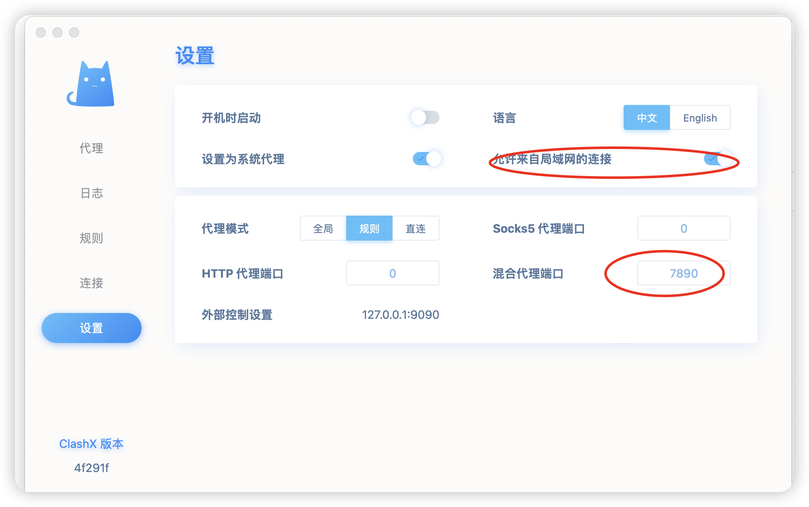

## clash开启局域网代理
* 直接使用dashboard配置

* 更细节的配置需要直接修改配置文件
相关配置如下(默认情况管理端口值监听127回环地址，混合代理如果选择的开启局域网代理会监听全部地址)
```
mixed-port: 7890
allow-lan: false
bind-address: "*"
mode: Rule
log-level: info
external-controller: 127.0.0.1:9090
```